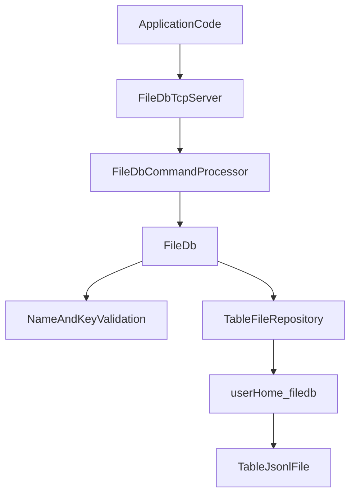

# FileDB

`database` is a standalone TCP key-value server with file persistence.

## Storage

- Root directory: `<user.home>/filedb`
- One table = one file: `<table>.jsonl`
- Each write appends a JSON line record with `key` and `value`
- Reads scan from bottom to top to return the latest value for a key

## TCP Commands

- `CREATE_TABLE <tableName>`
- `PUT <tableName> <key> <value>`
- `GET <tableName> <key>`

## Responses

- `OK`
- `VALUE <value>`
- `NOT_FOUND`
- `ERROR table_not_found`
- `ERROR invalid_command`

## Architecture

