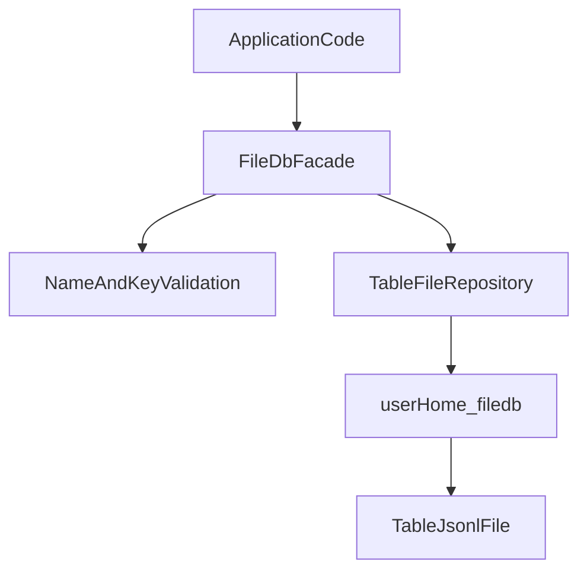

# FileDB

`database` is an in-process key-value library with file persistence.

## Storage

- Root directory: `<user.home>/filedb`
- One table = one file: `<table>.jsonl`
- Each write appends a JSON line record with `key` and `value`
- Reads scan from bottom to top to return the latest value for a key

## API

- `createTable(tableName)`
- `put(tableName, key, value)`
- `get(tableName, key)`

## Architecture

