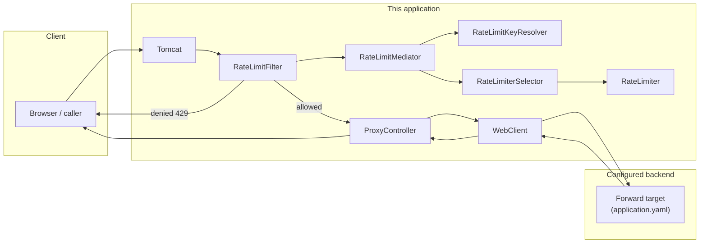
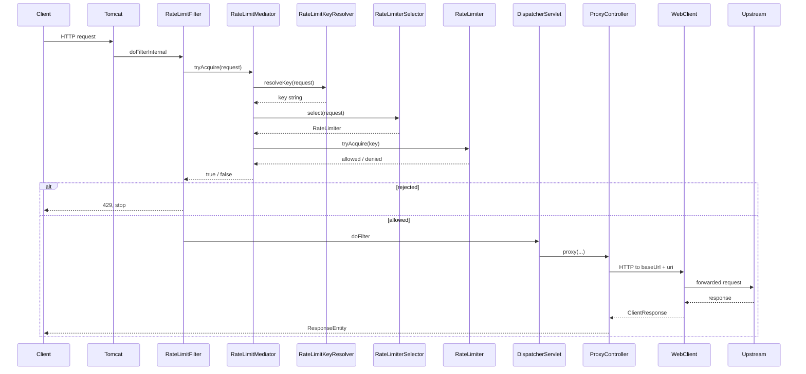

# Rate limiting flow

This document describes how an HTTP request is checked against the configured limit and, when allowed, forwarded upstream.

## Abstractions

Core extension points:

| Type | Responsibility |
|------|----------------|
| `RateLimitKeyResolver` | Turns an `HttpServletRequest` into a **string key** (who is being limited). Default: `IpRateLimitKeyResolver` → `ClientIpResolver` (IP). |
| `RateLimiter` | Decides whether a request is allowed for a given key. Default: **`TokenBucketRateLimiter`**. |
| `RateLimiterSelector` | **`select(request)`** only: picks which **`RateLimiter`** applies (e.g. by JWT role); **does not** take or forward the rate-limit key. Default: **`FixedRateLimiterSelector`**. When **`ratelimiter.jwt.secret`** is set: **`JwtRoleRateLimiterSelector`** (missing/invalid JWT or non-admin **`role`** → user bucket; admin → **`ratelimiter.admin-rate-limit`** bucket). |
| `RateLimitMediator` | **Mediator**: `tryAcquire(request)` → **`RateLimitKeyResolver`** yields the key; **`RateLimiterSelector.select(request)`** picks the limiter **without** the key; mediator then **`tryAcquire(key)`** on that limiter. Default: **`DefaultRateLimitMediator`**. |

## High-level view

At a glance:

- **Rate limiting** runs in a servlet **filter** before Spring MVC dispatches to `ProxyController`.
- **`RateLimitMediator`** composes key resolution, **`RateLimiterSelector`**, and the chosen **`RateLimiter`** per request.
- **Proxying** is unchanged: catch-all controller + `WebClient` to the configured base URL.

## Request path through the stack

### 1. Servlet container and filter chain

Tomcat receives the HTTP request. `RateLimitFilter` is ordered **`HIGHEST_PRECEDENCE`**, so it runs before `DispatcherServlet`.

### 2. `RateLimitFilter`

Calls **`rateLimitMediator.tryAcquire(request)`**. If `false`, **429** and return; if `true`, **`filterChain.doFilter`**.

### 3. `RateLimitMediator` (default: `DefaultRateLimitMediator`)

1. **`keyResolver.resolveKey(request)`** → string key.
2. **`rateLimiterSelector.select(request)`** → **`RateLimiter`** for this request (no key; e.g. JWT role or fixed).
3. **`rateLimiter.tryAcquire(key)`** → pass/fail for the request.

### 4. `RateLimitKeyResolver` (default: `IpRateLimitKeyResolver`)

`IpRateLimitKeyResolver` delegates to **`ClientIpResolver`**: first `X-Forwarded-For` hop, else `getRemoteAddr()`.

### 5. `RateLimiter` (default: `TokenBucketRateLimiter`)

- **`ConcurrentHashMap<String, TokenBucket>`** from key to bucket.
- **`computeIfAbsent`** creates a **`TokenBucket`** with capacity, refill rate, and **`Clock`** from configuration.
- Delegates to **`TokenBucket.tryConsume()`**.

### 6. `TokenBucket`

Refill by elapsed time, then consume one token if available; otherwise deny.

### 7. Configuration (`RatelimiterProperties` + `RatelimiterConfiguration`)

- **`Clock`**, **`TokenBucketRateLimiter`**, **`IpRateLimiter`** (optional), **`RateLimitKeyResolver`**, **`RateLimiterSelector`** ( **`FixedRateLimiterSelector`** or **`JwtRoleRateLimiterSelector`** when JWT secret is set), **`RateLimitMediator`** (`DefaultRateLimitMediator`), **`WebClient`**.
- **`ratelimiter.jwt`**: **`secret`** (HS256; leave empty to disable role-based selection), **`role-claim`**, **`admin-role-value`**. **`ratelimiter.admin-rate-limit`**: capacity and refill for the admin bucket when JWT selection is active.

### 8. Allowed path: `ProxyController`

Unchanged: forward method, URI, headers, body to upstream.

## End-to-end sequence

## Extending behavior

### Different key (e.g. JWT username)

Implement **`RateLimitKeyResolver`**: parse the `Authorization` header, validate the JWT, extract the subject, return it as the key (or a stable string like `"user:" + subject`).

Register a **`@Bean`** of type **`RateLimitKeyResolver`**. Because of **`@ConditionalOnMissingBean`**, the default **`IpRateLimitKeyResolver`** bean is skipped automatically.

### Different algorithm (e.g. sliding window)

Implement **`RateLimiter`** with a backing store keyed by the same string key. Register a **`@Bean`** of type **`RateLimiter`**; the default **`TokenBucketRateLimiter`** bean is skipped, and **`IpRateLimiter`** is not registered (it depends on **`TokenBucketRateLimiter`**).

You can combine a custom **`RateLimiter`** with the default **`IpRateLimitKeyResolver`**, or the opposite, by only overriding one bean. **`DefaultRateLimitMediator`** picks up the injected **`RateLimitKeyResolver`** and **`RateLimiterSelector`** (which wraps your **`RateLimiter`** bean unless you replace the selector).

### Role-based limiter (custom selector)

Implement **`RateLimiterSelector`** (`select(request)` only; no key) to return different **`RateLimiter`** instances or equivalent policies. Register a **`@Bean`** of type **`RateLimiterSelector`**; the default selector bean is skipped when yours is present. You can keep **`DefaultRateLimitMediator`**; it injects **`RateLimiterSelector`**.

### Custom orchestration

Implement **`RateLimitMediator`** if you need different coordination (e.g. multiple limiters, metrics, or key resolution that depends on limiter state). Register a **`@Bean`** of type **`RateLimitMediator`**; the default **`DefaultRateLimitMediator`** is not registered.

## Summary table

| Step | Class / component | Role |
|------|-------------------|------|
| Entry | Tomcat | HTTP I/O, servlet API |
| Gate | `RateLimitFilter` | delegates `tryAcquire(request)` to mediator; 429 or continue chain |
| Mediator | `RateLimitMediator` | composes `RateLimitKeyResolver` + `RateLimiterSelector` + chosen `RateLimiter` (default: `DefaultRateLimitMediator`) |
| Key | `RateLimitKeyResolver` | Request → key string (default: IP via `IpRateLimitKeyResolver` / `ClientIpResolver`) |
| Selector | `RateLimiterSelector` | Request → which `RateLimiter` to use via `select(request)` only; key is not passed (default: `FixedRateLimiterSelector`; JWT: `JwtRoleRateLimiterSelector` when secret set) |
| Policy | `RateLimiter` | One logical limiter per key (default: `TokenBucketRateLimiter`) |
| IP layer | `IpRateLimiter` | Per-IP API over `TokenBucketRateLimiter` (optional bean) |
| Config | `RatelimiterProperties`, `RatelimiterConfiguration` | Limits, forward URL, `Clock`, default beans |
| Forward | `ProxyController`, `WebClient`, `HopByHopHeaders` | Proxy allowed requests to configured backend |
