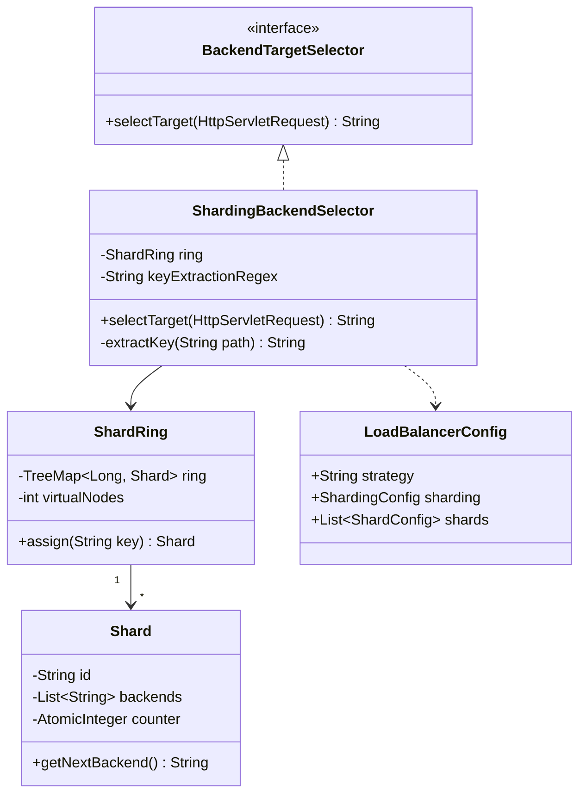
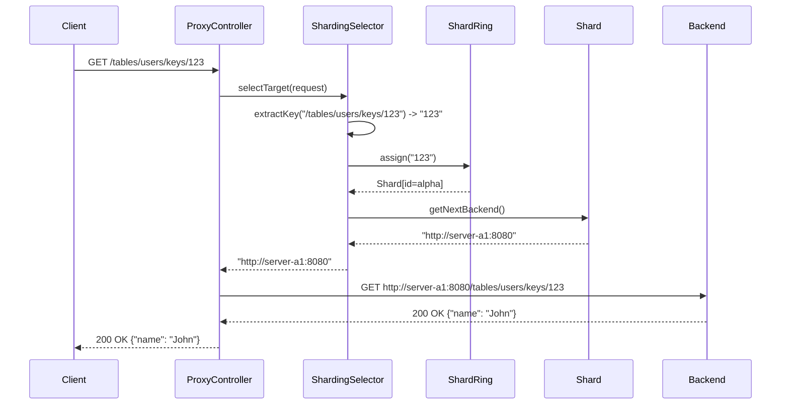
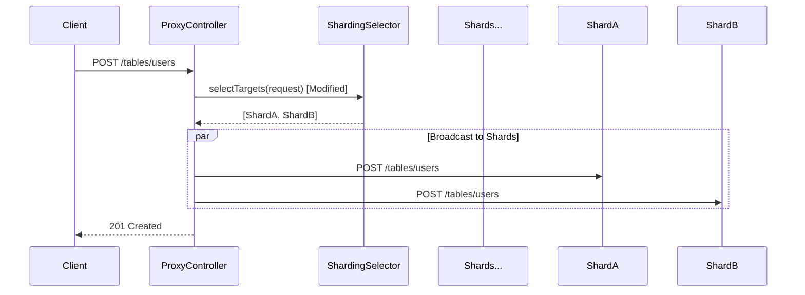

# Database Sharding Design

## Class Diagram

## Sequence Diagram: Sharded Request

## Sequence Diagram: Broadcast Request (Create Table)

*Note: This requires modifying ProxyController to handle multiple targets for specific paths.*

## Implementation Plan

1. **Refactor `ConsistentHashRing`**: Make it more generic to support mapping to `Shard` objects.
2. **Implement `ShardingBackendSelector`**: Add regex-based key extraction.
3. **Enhance Configuration**: Update `LoadBalancerConfig` to support hierarchical shard definitions.
4. **Modify `ProxyController`**: Add support for broadcast operations (e.g., table creation).
