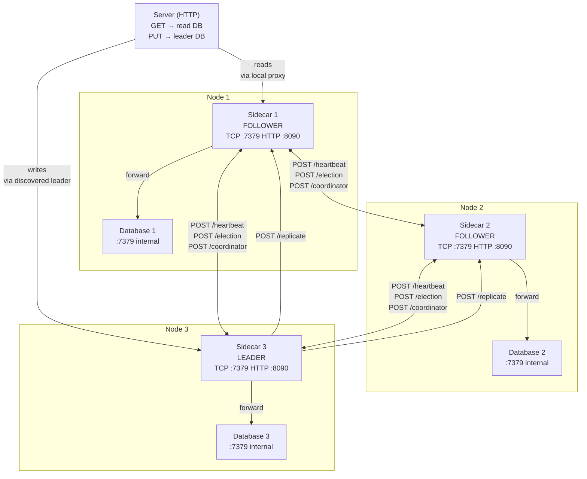
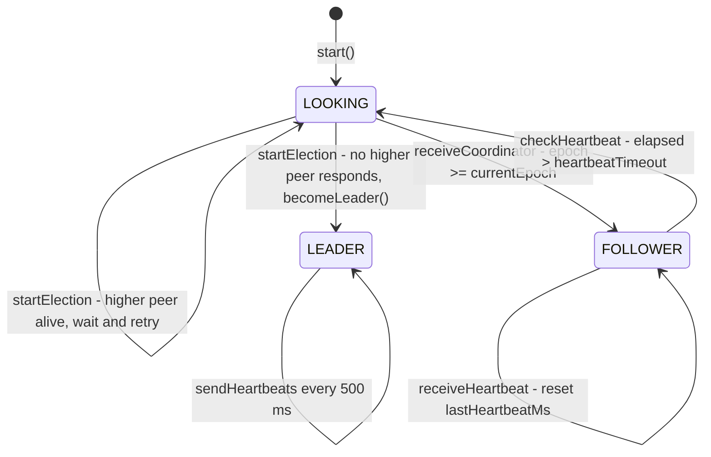
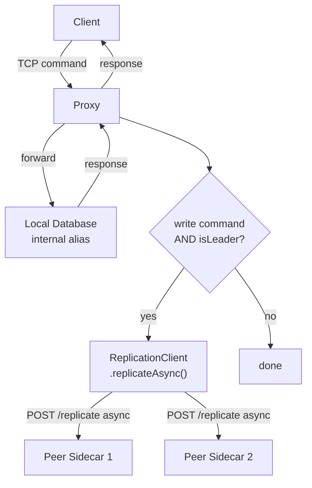
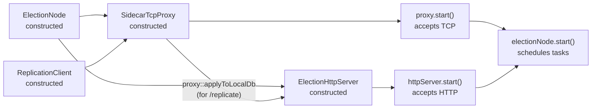

# Election Sidecar — Architecture

## Role in the System

The election sidecar runs as a separate process alongside each database node. The database knows nothing about clustering — it is a plain TCP key-value server. The sidecar handles everything else: electing a leader, proxying client commands, replicating writes to peers, and answering discovery queries from stateless servers.

Each sidecar proxy listens on the same port as the database it guards. To a client, the sidecar is indistinguishable from the database — it speaks the same TCP protocol. The real database is accessible only locally, on an internal alias.

---

## Components

### ElectionNode — State Machine

Implements a simplified bully algorithm with epochs.

**Key state fields:**
- `currentEpoch` — logical term number, incremented on each election
- `currentLeaderId` — node ID of the acknowledged leader (-1 if unknown)
- `lastHeartbeatMs` — timestamp of last heartbeat received from leader

**Timing** (from `ElectionConfig.healthCheckIntervalMs`, default 500 ms):

| Timer | Formula | Default |
|-------|---------|---------|
| Election timeout | `healthCheckIntervalMs × 3` | 1 500 ms |
| Heartbeat timeout | `healthCheckIntervalMs × 2 + 150` | 1 150 ms |
| Heartbeat send rate | `healthCheckIntervalMs` | 500 ms |

### ElectionHttpServer — Coordination API

Exposes HTTP endpoints consumed by peer sidecars and by stateless servers.

| Method | Path | Caller | Purpose |
|--------|------|--------|---------|
| `GET` | `/status` | Server (discovery) | Returns this node's current state and leader coordinates |
| `POST` | `/election` | Peer sidecar | Peer announces candidacy |
| `POST` | `/coordinator` | Peer sidecar (new leader) | Leader announces itself after winning election |
| `POST` | `/heartbeat` | Peer sidecar (leader) | Leader proves it is alive |
| `POST` | `/replicate` | Peer sidecar (leader) | Leader sends a write command to apply on this node's local DB |

### SidecarTcpProxy — Command Gateway

Write commands are `PUT` and `CREATE_TABLE`. Followers also accept writes through their proxy — the write is applied to the local replica — but followers do **not** call `replicateAsync`.

### ReplicationClient — Async Write Fan-Out

When called by a leader proxy, fires HTTP `POST /replicate` to every peer sidecar with the raw command as the request body. Uses a cached thread pool; requests are fire-and-forget with a 2-second timeout. Failures are logged but not retried.

---

## Startup Order

The proxy and HTTP server start before election begins so that peers can reach this node during the initial election.
