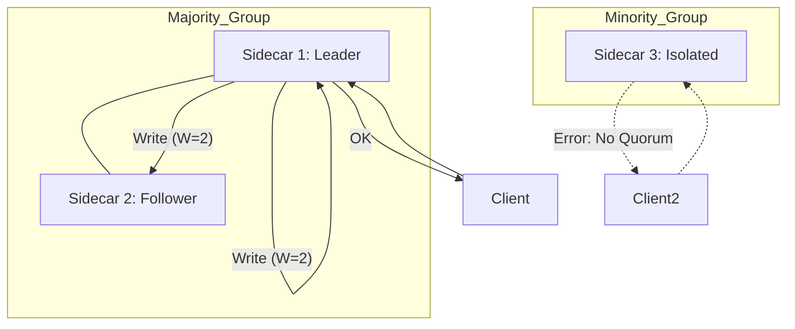
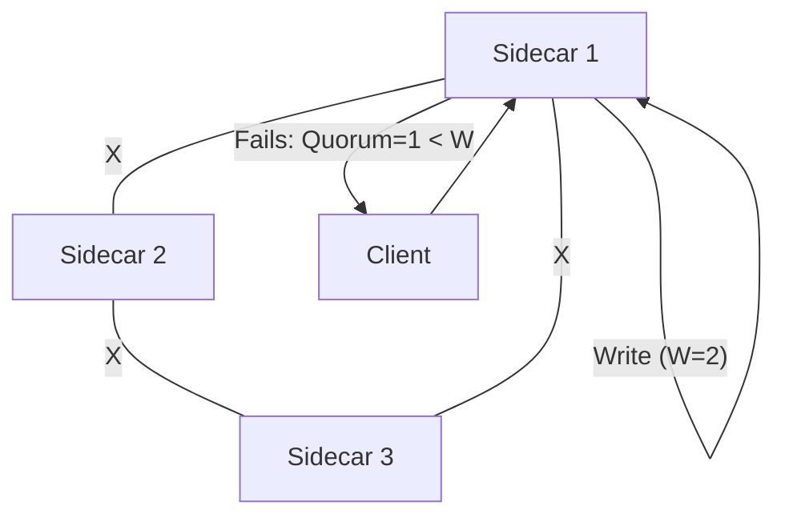

# Sidecar Consistency & Quorum Writes

The `election-sidecar` manages the coordination of writes to ensure strong consistency when `CONSISTENCY_MODE=STRICT` is enabled.

## Quorum Write Flow

1. **Proxy Write**: The leader sidecar receives a write command (`PUT` or `CREATE_TABLE`).
2. **Assign Version**: The leader increments its local logical clock to assign a new `version`.
3. **Local Write**: The leader writes the command + version to its local `database`.
4. **Synchronous Replication**: The leader sends the command + version to all peers.
5. **Acknowledge**: The leader waits for at least `QUORUM_W - 1` successful responses from peers.
6. **Respond**: If the quorum is met, it returns `OK` to the client. Otherwise, it returns `ERROR consistency_failure`.

## Network Partition Scenarios (N=3, W=2, R=2)

### Scenario 1: Majority Partition (2 vs 1)
In this scenario, two nodes can talk to each other but the third is isolated.

### Scenario 2: Total Isolation
Every node is partitioned from every other node.

## Configuration

- `CONSISTENCY_MODE`: `STRICT` or `EVENTUAL`.
- `QUORUM_W`: Minimum number of nodes for a successful write (usually `(N/2)+1`).
