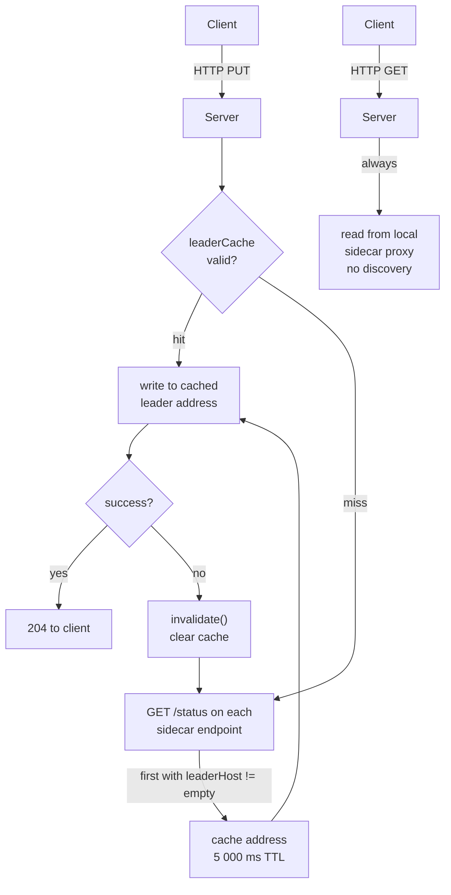
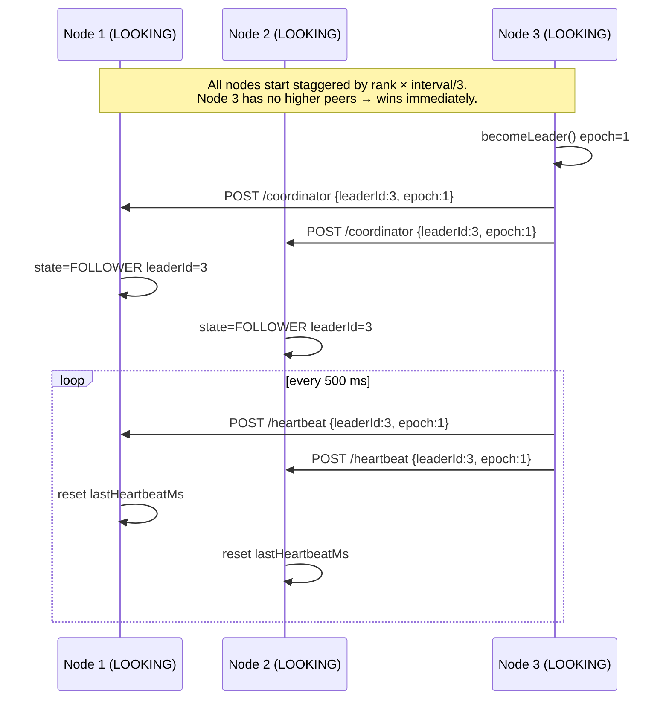
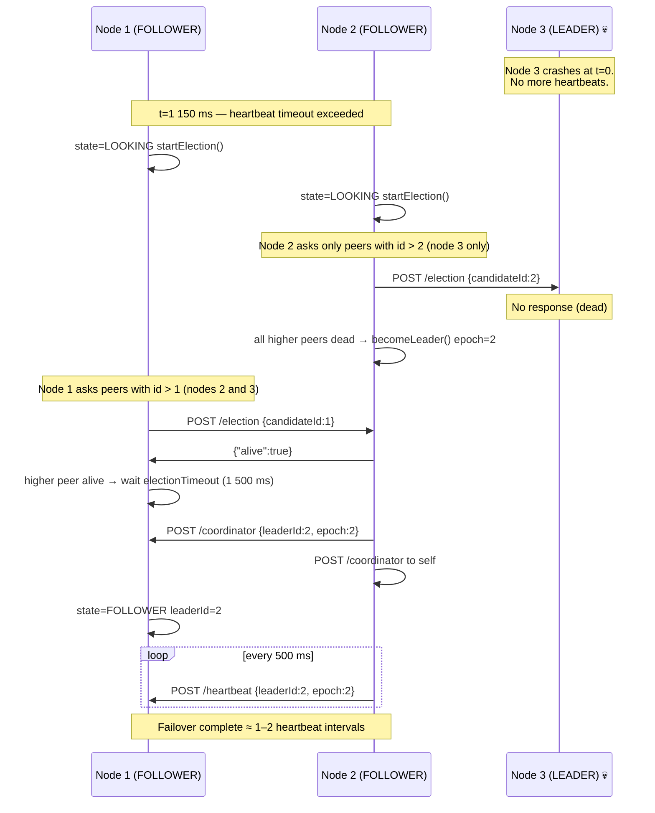
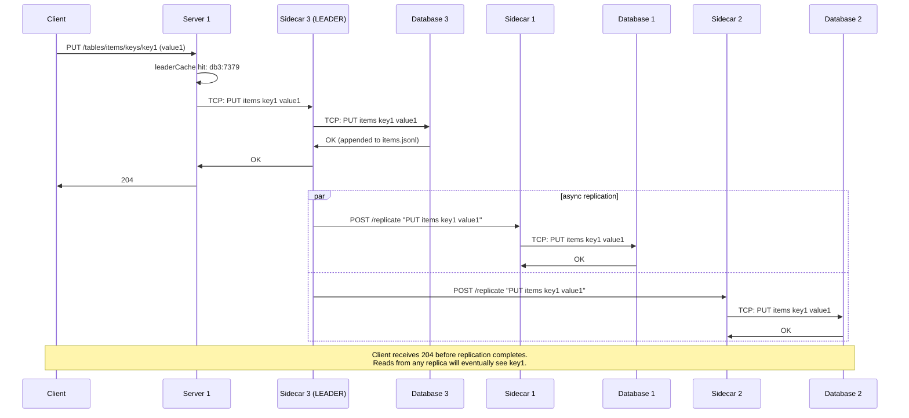
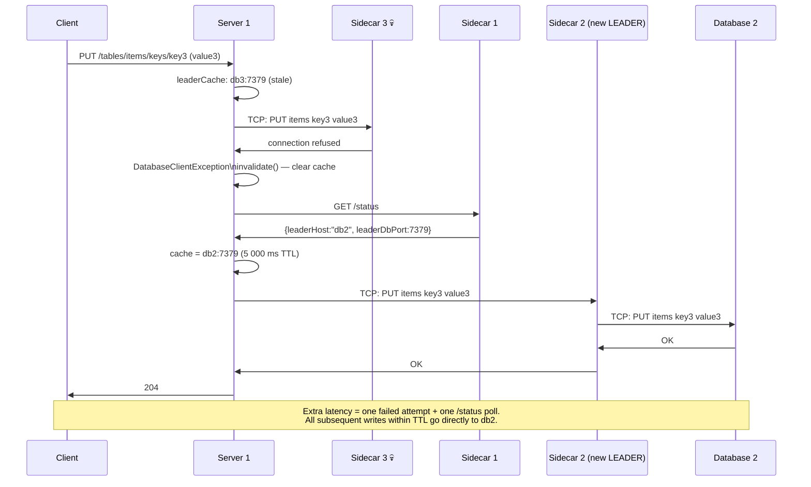

# Election Sidecar — Scenarios

## How the Client Finds the Leader

Stateless servers never talk to the election sidecars directly during reads. For writes, they use `LeaderDiscoveryClient`:

1. **Poll `/status` on every sidecar** until one responds with a non-empty `leaderHost` and non-zero `leaderDbPort`.
2. **Cache the result** for `cache-ttl-ms` (default 5 000 ms). All writes within that window go to the same leader address without another discovery round-trip.
3. **On write failure** (e.g. the cached leader address is stale), `invalidate()` clears the cache and the next write triggers a fresh poll.

Reads always go to the server's local sidecar proxy (configured statically via `DATABASE_URL`). Because every sidecar proxy applies writes to its own local database — both from clients and from the `/replicate` endpoint — every node is an eventually consistent replica that can serve reads.



The `/status` response shape:
```json
{
  "nodeId": 3,
  "state": "LEADER",
  "leaderId": 3,
  "epoch": 1,
  "selfHost": "db3",
  "selfDbPort": 7379,
  "selfElectionPort": 8090,
  "leaderHost": "db3",
  "leaderDbPort": 7379,
  "leaderElectionPort": 8090
}
```

A follower includes the leader's coordinates in its own `/status` response, so any sidecar in the cluster can answer a discovery query — not only the leader itself.

---

## Initial Election (Cluster Start)

Three nodes start with IDs 1, 2, 3. Each enters `LOOKING`.



Node 3 wins because the bully algorithm gives victory to the highest ID that is alive and reachable. Lower-ranked nodes defer to higher-ranked ones — they respond "alive" to `/election` and let the highest reachable ID claim leadership.

---

## Leader Dies — Failover Walkthrough

Cluster is running: node 3 = leader, nodes 1 and 2 = followers.



Node 2 wins because it is the highest-ID node still reachable. Node 1 defers to node 2 the same way node 2 deferred to node 3.

---

## Write Path Through a Live Cluster



---

## Write After Leader Failover (Stale Cache)

Node 3 has just died. Node 2 is the new leader. Server 1's cache still points to `db3:7379`.


