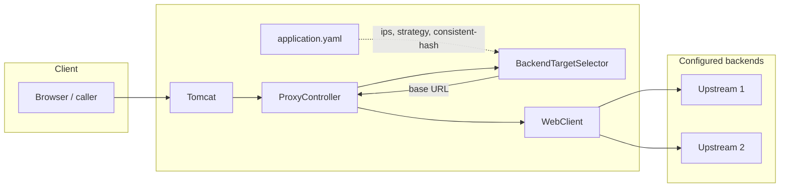

# Load balancer

## High-level view



Traffic enters the load balancer as ordinary HTTP. **`ProxyController`** asks **`BackendTargetSelector`** for a base URL, then forwards method, path, query, headers, and body with **`WebClient`**.

**`loadbalancer.strategy`:**

- **`round-robin`** — cycles through **`loadbalancer.ips`** in order.
- **`consistent-hash`** — each backend is placed on a sorted hash ring as **`virtualNodesPerServer`** virtual replicas (default **10**), so load is spread more evenly and adding or removing a server moves fewer clients than with a single point per machine. Each replica hashes a string **`host#i`** or, when the configured URL has an explicit port in the parsed URI, **`host:port#i`**, where **`i`** is `0 .. virtualNodesPerServer-1`. The client IP from **`X-Forwarded-For`** (first hop) or **`remoteAddr`** is hashed; the request goes to the backend owning the first ring point at or after that hash, wrapping to the smallest hash if the client hash is past the end of the ring. Prefer **distinct backend identities** (different hosts, or same host with different explicit ports in the URL) so two logical servers do not share identical `host`/`host:port` keys.

Hashes use **Guava MurmurHash3 128-bit** (`asLong()`), which is deterministic and stable for the same strings.

## Configuration

Set **`loadbalancer.ips`** to full base URLs (scheme, host, port) of each backend.

```yaml
loadbalancer:
  strategy: round-robin
  ips:
    - http://10.0.0.1:8080
    - http://10.0.0.2:8080
```

Use **`strategy: consistent-hash`** for client-IP–sticky routing across backends.

For consistent hashing only, optional nested settings control how many virtual nodes each backend gets (same count for every server; default **10**):

```yaml
loadbalancer:
  strategy: consistent-hash
  ips:
    - http://10.0.0.1:8080
    - http://10.0.0.2:8080
  consistent-hash:
    virtual-nodes-per-server: 10
```

Use a value of at least **1**. Higher values usually improve balance on the ring at the cost of more memory and slightly more work when rebuilding the ring.

At least one **`ips`** entry is required.
