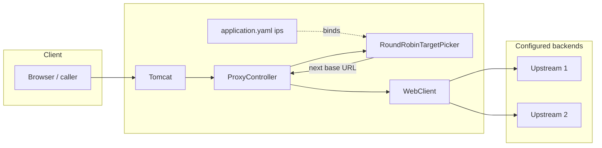

# Load balancer

## High-level view



Traffic enters the load balancer as ordinary HTTP. For each request, **`RoundRobinTargetPicker`** chooses the next **`loadbalancer.ips`** entry in rotation. **`ProxyController`** forwards the same method, path, query, headers, and body to that base URL using **`WebClient`**, then returns the upstream response.

## Configuration

Set **`loadbalancer.ips`** to full base URLs (scheme, host, port) of each backend instances:

```yaml
loadbalancer:
  ips:
    - http://10.0.0.1:8080
    - http://10.0.0.2:8080
```

At least one entry is required.
