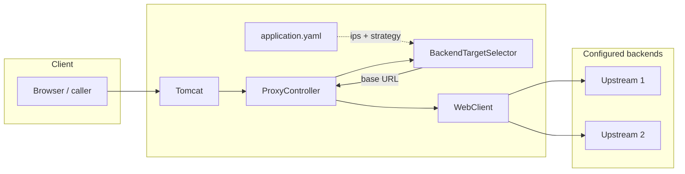

# Load balancer

## High-level view



Traffic enters the load balancer as ordinary HTTP. **`ProxyController`** asks **`BackendTargetSelector`** for a base URL, then forwards method, path, query, headers, and body with **`WebClient`**.

**`loadbalancer.strategy`:**

- **`round-robin`** — cycles through **`loadbalancer.ips`** in order.
- **`consistent-hash`** — one point per backend on a hash ring (no virtual nodes). Each backend URL’s **host** string (the configured server identity, typically a literal IP or hostname) is hashed onto the ring. The client IP from **`X-Forwarded-For`** (first hop) or **`remoteAddr`** is hashed; the request is sent to the first backend at or after that position on the ring, wrapping to the smallest position if needed (full ring). Use **distinct host values** per backend (for example different IPs or `127.0.0.1` vs `localhost`) so each server gets its own slot; two URLs that share the same host collapse to one slot.

Hashes use **Guava MurmurHash3 128-bit** (`asLong()`), which is deterministic and stable for the same strings.

## Configuration

Set **`loadbalancer.ips`** to full base URLs (scheme, host, port) of each backend. For consistent hashing, use **different host strings** per backend so each server occupies a distinct ring slot (same host twice would collide on one slot).

```yaml
loadbalancer:
  strategy: round-robin
  ips:
    - http://10.0.0.1:8080
    - http://10.0.0.2:8080
```

Use **`strategy: consistent-hash`** for client-IP–sticky routing across backends.

At least one **`ips`** entry is required.
