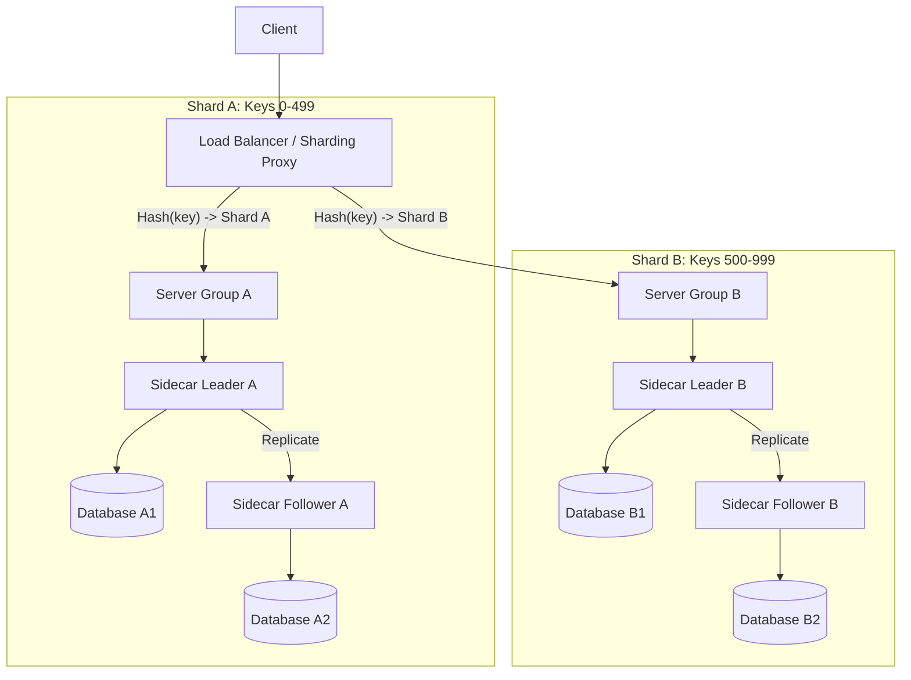

# Database Sharding Implementation Plan

This document describes the strategy for implementing horizontal sharding in the distributed key-value store. Sharding allows the system to scale by distributing data across multiple independent replication groups (shards).

## 1. Architectural Changes

### High-Level Request Flow (Sharding + Replication)



## 2. Scaling Scenarios

### Adding a New Replica (Intra-shard Scaling)
*   **Action**: Add a new `Sidecar` + `Database` instance to an existing Shard (e.g., Shard A).
*   **Effect on Sharding**: **Zero impact**. The Load Balancer's sharding ring remains unchanged because the mapping of keys to Shard A is constant.
*   **Effect on System**: 
    - Increases read throughput for Shard A (if reads are distributed).
    - Increases fault tolerance for Shard A.
    - The new replica simply joins the existing election quorum for that shard.

### Adding a New Shard (Horizontal Scaling)
*   **Action**: Deploy a new Shard C and update the Load Balancer's configuration.
*   **Effect on Sharding**: The `ConsistentHashRing` is updated, and a subset of keys is reassigned to Shard C.
*   **Auto-Rebalancing**: The system automatically initiates a background data migration from the old shards to the new shard.

## 4. Automatic Key Rebalancing

To ensure "auto" rebalancing, the system will follow a **Migration-Aware Proxying** strategy.

### 1. Detection & Initiation
When the Load Balancer detects a new shard in its configuration, it calculates the "stale" keyspace (the keys that moved from existing shards to the new one). It then notifies the new shard to start a background migration.

### 2. The "Read-Through / Write-Forward" Phase
During migration, the Load Balancer begins routing all requests for the reassigned keyspace to the **new shard**.
- **Writes**: Requests are sent to the new shard. This ensures that any new or updated data is immediately stored in the correct location.
- **Reads**:
    1. The client requests a key from the Load Balancer.
    2. The LB routes it to the **new shard**.
    3. If the new shard does not have the key yet (migration in progress), it **proxies the read** to the old (source) shard.
    4. The new shard returns the value to the LB and optionally "upserts" it locally to accelerate the migration (Lazy Migration).

### 3. Background Data Transfer
While the proxying handles live traffic, the new shard's `server` instances will execute a bulk transfer:
- It iterates through the keyspace on the source shard (via a new `/internal/export` API).
- It streams the data and writes it to the local database.
- This process is throttled to avoid impacting production performance.

### 4. Completion & Cleanup
Once the background transfer is verified:
- The new shard stops proxying reads to the old shard.
- The old shard is notified to perform a background `DELETE` of the keys it no longer owns to reclaim disk space.

### 5. Shard Removal (Graceful Decommissioning)
Removing a shard follows the inverse of the addition process:
1.  **Mark Decommissioning**: The shard is flagged in the configuration.
2.  **Write-Shift**: The Load Balancer immediately redirects new writes to the *next* shard in the consistent hash ring (the one that will eventually inherit the keys).
3.  **Read-Through**: Reads are first attempted at the new owner; if not found, they are proxied to the decommissioning shard.
4.  **Final Migration**: A background process pushes all remaining data from the decommissioning shard to the new owners.
5.  **Shutdown**: Once the decommissioning shard is empty, it is safely removed from the ring and shut down.

## 5. High Availability (HA) for the Load Balancer

To prevent the Load Balancer from becoming a Single Point of Failure (SPOF):

### 1. Leader Election for LBs
We will adapt the `election-sidecar` pattern for the Load Balancer instances.
- **Active/Standby**: Multiple LB instances run in parallel. 
- **Leader Role**: One LB is elected as the "Primary." While all instances can technically route traffic (stateless routing), the Leader instance is responsible for coordinating rebalancing tasks and health monitoring of the shards.
- **Failover**: If the Leader LB fails, another instance detects the heartbeat loss and takes over the primary role and the associated VIP (if using a tool like Keepalived) or updates a service mesh/DNS entry.

### 2. Statelessness
By keeping the `ConsistentHashRing` deterministic (based strictly on configuration) and the migration state either in the shards themselves or a shared lightweight store, any LB instance can pick up the work of another at any time.

## 6. Backward Compatibility & Versatility

The Load Balancer will remain a general-purpose tool.

- **Multiple Strategies**: The `BackendTargetSelector` interface allows us to switch behaviors via configuration:
    - `round-robin`: Original behavior for stateless REST APIs.
    - `consistent-hash`: Original behavior for session-sticky IP routing.
    - `sharding-consistent-hash`: New behavior for database sharding.
- **Selective Sharding**: Sharding logic will only trigger for paths matching the `sharding.path-pattern`. All other traffic (e.g., `/health`, `/metrics`, or other service APIs) will fall back to the default load balancing strategy.

## 7. Handling Replication + Sharding


We will use **Consistent Hashing** on the database key to map requests to shards. This minimizes data movement when adding or removing shards.

### Hashing Key
- For `PUT /tables/{table}/keys/{key}`: The sharding key is `{key}`.
- For `GET /tables/{table}/keys/{key}`: The sharding key is `{key}`.
- For `POST /tables/{table}` (Create Table): This operation must be **broadcast** to all shards to ensure the table structure exists across the entire cluster.

### Implementation: Load Balancer as Sharding Proxy
Since the `loadbalancer` already functions as a reverse proxy (using `ProxyController` and `WebClient`), we will implement sharding directly within it. There is no need for a separate library.

- **`ConsistentHashRing`**: We will extend the existing ring logic to support hashing arbitrary strings (like database keys) instead of just client IPs.
- **`KeyExtraction`**: The `loadbalancer` will be configured with path patterns to identify which part of the URL contains the sharding key.

## 3. Load Balancer Updates

The `loadbalancer` module will be enhanced to support sharding-aware routing.

### Configuration Schema
```yaml
loadbalancer:
  strategy: sharding-consistent-hash
  sharding:
    path-pattern: "/tables/[^/]+/keys/([^/]+)" # Regex to extract {key}
  shards:
    - id: 0
      name: "shard-alpha"
      backends: ["http://server-alpha-1:8080", "http://server-alpha-2:8080"]
    - id: 1
      name: "shard-beta"
      backends: ["http://server-beta-1:8080", "http://server-beta-2:8080"]
```

### Components
- **`ShardingBackendSelector`**: Implements `BackendTargetSelector`. It extracts the key from the request path, uses `ConsistentHashRing` to identify the shard, and then performs internal load balancing (e.g., Round Robin) among the backends of that shard.

## 4. Handling Replication + Sharding

Each shard is an independent **Replication Group** managed by the existing `election-sidecar` and `server` logic.

- **Shard Isolation**: Shard A and Shard B have different sets of sidecar instances and separate leader election cycles.
- **Server Configuration**: `server` instances are deployed per shard. A server in "Shard Alpha" is configured with the `electionEndpoints` of Shard Alpha's sidecars.
- **Write Path**: 
    1. LB hashes `key` to `Shard Alpha`.
    2. LB forwards request to a `server` in `Shard Alpha`.
    3. `server` discovers the current leader sidecar in `Shard Alpha`.
    4. Leader sidecar writes to its local `database` and replicates to followers within `Shard Alpha`.
- **Read Path**: Similar to write, but can be routed to any sidecar (leader or follower) in the shard depending on the `server`'s consistency settings.
