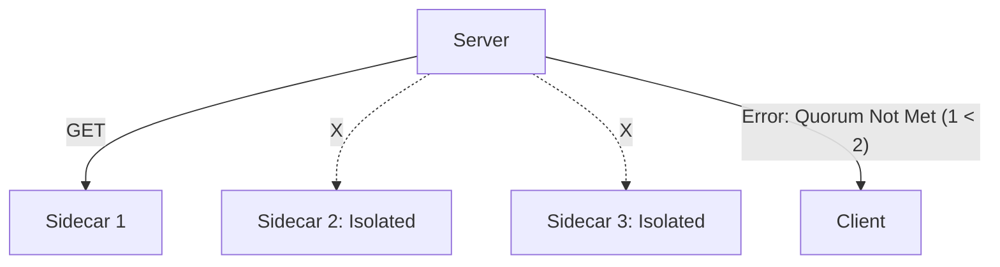

# Server Quorum Reads

The `server` module acts as the read coordinator in `STRICT` consistency mode.

## Quorum Read Flow

1. **Request**: Client sends a `GET` request to the server.
2. **Parallel Reads**: The server identifies all available sidecar proxies (via `PEERS` or `LeaderDiscoveryClient`).
3. **Fetch**: It sends the `GET` command to `QUORUM_R` proxies in parallel.
4. **Conflict Resolution**:
   - The server collects the records (including versions) from the proxies.
   - It filters out any errors or "not found" responses (unless all nodes report "not found").
   - It selects the value with the **highest version number**.
5. **Respond**: The latest value is returned to the client.

## Read Partition Scenario (N=3, R=2)

If a server can only reach 1 node, it cannot satisfy the quorum requirement.

## Configuration

- `CONSISTENCY_MODE`: `STRICT` or `EVENTUAL`.
- `QUORUM_R`: Minimum number of nodes for a successful read.
